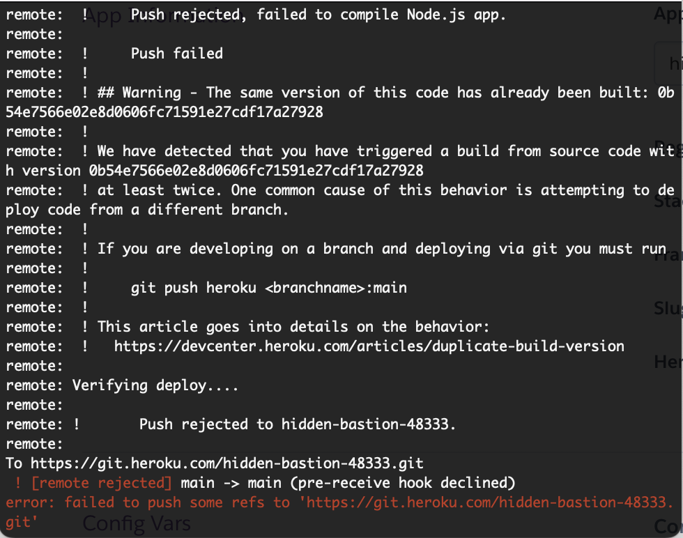

# Challenge 21: MERN Book Search Engine

## Description
This was suposed to be a refactoring of a book search engine from RESTful to GraphQL. I was able to refactor the code, but was unable to deploy the app to Heroku due to an error that I am unable to resolve in time.

## Table of Contents
- [Demonstration](#demonstration)
- [Usage](#usage)
- [Credits](#credits)
- [Questions](#questions)

## User Story

```
AS AN avid reader
I WANT to search for new books to read
SO THAT I can keep a list of books to purchase
```

## Demonstration
Here is the error I am encountering:


## Credits
Made by Jack Atkerson
Starter code from:
https://github.com/coding-boot-camp/solid-broccoli 

## Questions
Feel free to reach out to me at:
[E-Mail](mailto:jatkerson18@gmail.com),
[GitHub](https://github.com/JackAtkerson)